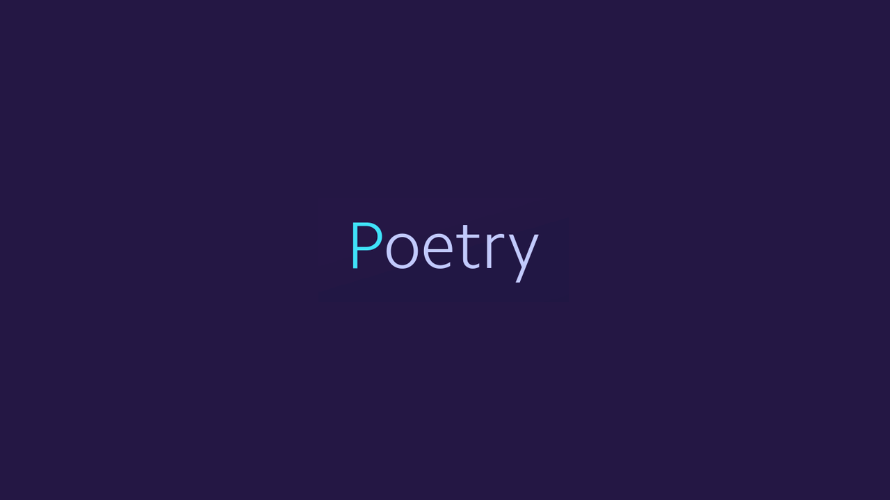

# Bonnes pratiques développement Python 

## Description
Ce projet à pour but de servir d'exemple, en couvrant un maximum d'outils et de bonnes pratiques, notamment:

  * Installation de Python
  * Création d'un environnement de développement 
  * Normes de développements
  * Bonnes pratiques

Recommandation d'IDE: [VSCode](https://code.visualstudio.com/)

<br>
<br>

## 1-Installation de Python
### Anaconda
  <p align="left">
    
  </p>

  Anaconda est une distribution libre et open-source du langage Python, téléchargeable: [ici](https://www.anaconda.com/products/distribution)\
  Conda (fourni par cette distribution Anaconda), à l'avantage d'avoir un manager qui permet **d'installer des librairies/dépendances autre que celles de Python** et permet également de gérer **les environnements**\
  On utilisera par la suite Anaconda Prompt, qui est également installé via le lien\
    <p align="left">
    
  </p>

<br>
<br>

## 2-Création d'un environnement de développement 
### a) Installation de Poetry (unique)
  <p align="left">
    
  </p>

  Poetry est un outil de management de dépendances et de packages Python. Son installation peut se faire via pip dans un environnement Python défini ou bien **globalement sur le système, afin de le rendre disponible en dehors de l'environnement Python**:
  1. Lancer Anaconda Prompt
  2. Exécuter la commande Powershell dans Anaconda Prompt:
  ```powershell
  powershell
  ```
  3. Une fois la commande `powershell` exécutée, installer Poetry: 
  ```powershell
  (Invoke-WebRequest -Uri https://raw.githubusercontent.com/python-poetry/poetry/master/get-poetry.py -UseBasicParsing).Content | python -
  ```
  Poetry est désormais installé sur la machine, pour plus d'informations, c'est [ici](https://python-poetry.org/)

<br>

### b) Conda
  Conda (notamment via le prompt), va nous permettre de manager les environnements isolés de développement
  <p style='color:orange'>La recommandation est de mettre en place un environnement virtuel par projet (initialisé avec Poetry)</p>

  1. Lancer Anaconda Prompt (par défaut, l'environnement actif est celui de base)
  2. Créer un environnement virtuel Conda, dans la version de Python souhaitée
  ```bash
  conda create -n nom_env python=3.X -y
  ```
  3. Une fois l'environnement créé, on peut vérifier son existence
  ```bash
  conda env list
  > nom_env   C:\user_path\anaconda3\envs\nom_env
  ```
  4. On peut désormais l'activer (on remarquera dans le prompt le change du nom d'environnement actif qui n'est plus celui de base)
  ```bash
  conda activate nom_env 
  ```
  5. On peut également vérifier la version de python
  ```bash
  python --version
  > Python 3.X
  ```

  L'environnement virtuel pour débuter le projet est désormais prêt, plus d'infos sur Conda [ici](https://docs.conda.io/en/latest/)

<br>


### b) Initialiser un projet avec Poetry
  Poetry permet d'initialiser un projet avec une structure par défaut, et dont le management des packages et de dépendances se géreront avec\
  Le comportement par défaut de la commande d'initialisation de projet via Poetry, est **d'utiliser l'environnement Conda dans lequel la commande est lancée**\

  1. Lancer Anaconda Prompt
  2. Activer l'environnement pour le projet
  ```bash
  conda activate nom_env 
  ```
  3. Se déplacer dans le répertoire du projet a créer et lancer la commande poetry new
  ```bash
  cd root/path/to/project
  mkdir project_src
  cd project_src
  poetry new project_name 
  ```
  4. Le projet Poetry est désormais créer, avec cette arborescence:
  ```bash
  project_src
  │   pyproject.toml
  │   README.rst  
  │
  └───project_name
  │       __init__.py
  │
  └───tests
          __init__.py
          test_project_name.py
  ```
  * **pyproject.toml** : fichier des dépendances du projet. Il est possible d'ajouter les dépendances manuellement dans ce fichier (peu recommandé) mais dans le cadre de bonnes pratiques, il suffit ajouter les dépendances, dans l'environnement du projet (Conda prompt dans l'environnement du projet), via ``` poetry add librairie```
  * **README.rst** : Readme du projet
  * **project_name** : répertoire contenant la partie code (hors test, à adapter)
  * **test** : contient la partie test du code (à adapter)
  * *Les fichiers init servent à Python en tant que constructeurs, pour les imports (ne pas y toucher et bien penser à ajouter ceux dans le projet au fûr et à mesure)*

<br>

### c) Actualiser un environnement sur la base d'un projet Poetry
  Une fois le projet Poetry initialisé/récupéré (depuis un repo git par exemple), on peut alors actualiser l'environnement dans lequel on se trouve (qui va se baser sur le pyproject.toml)
  1. Lancer Anaconda Prompt
  2. Activer l'environnement pour le projet
  ```bash
  conda activate nom_env 
  ```
  3. Lancer une commande poetry install dans le projet
  ```bash
  cd project_src
  poetry install
  ```
  L'environnement est désormais actualisé\
  Dans l'arborescence du projet, on va désormais trouver un nouveau fichier,  **poetry.lock**:
  ```bash
  project_src
  │   pyproject.toml
  │   README.rst 
  │   poetry.lock
  │
  └───project_name
  │       __init__.py
  │
  └───tests
          __init__.py
          test_project_name.py
  ```
  Le fichier poetry.lock contient des dépendances plus précises que le le fichier toml
  - Si la commande `poetry install` n'a jamais été lancé et qu'il n'y pas de fichier poetry.lock dans le projet, Poetry  va tout simplement résoudre les dépendances présentes dans le fichier pyproject.toml  et télécharger leurs dernières versions. Une fois terminée, le fichier poetry.lock va être créé avec toutes les dépendances exactes, qui serviront dans le cas d'un autre install
  - Si les fichiers poetry.lock et pyproject.toml existent , l'exécution de la commande poetry install, va alors actualiser l'environnement actuel pour correspondre parfaitement avec ces dépendances\

  <p style='color:orange'>Ne pas oublier de commit le fichier également ces fichiers pour permettre aux autre contributeurs du projet de réutiliser l'environnement ou bien le mettre à jour avec des nouvelles dépendances</p>

<br>

### d) Intégration de l'environnement du projet dans VSCode 
  Une fois le projet Poetry initialisé et l'environnement Conda prêts, afin de fluidifier les interactions avec l'environnement (éviter de passer par Anaconda Prompt), il est possible d'ajouter Anaconda Prompt a PowerShell 

  1. Lancer Anaconda Prompt
  2. Ajouter Anaconda Prompt a Powershell
  ```bash
  conda init powershell
  ```
  3. Lancer Powershell en tant qu'admin
  ```bash
  Set-ExecutionPolicy -Scope CurrentUser -ExecutionPolicy Unrestricted
  O
  ```
  4. Désactiver conda activate par défaut
  ```bash
  conda config --set auto_activate_base false
  ```

  Désormais, les commandes conda sont accessibles dans Powershell (et donc dans le terminal de VSCode)

