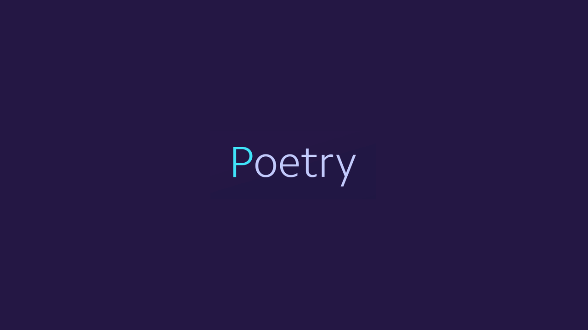

# 2-Environnement de développement reproductible: Conda & Poetry :fast_forward:
## a) Intégration de conda à Powershell et CMD (à faire une seule fois)
\
  Afin de fluidifier les interactions avec Anaconda (éviter de passer par Anaconda Prompt), il est possible d'ajouter Anaconda Prompt a PowerShell /CMD (afin d'utiliser un seul outil d'invité de commande, notamment sur VSCode):
<p style='color:green'> <b>Powershell</b></p>

  1. Lancer Anaconda Prompt
  2. Ajouter Anaconda Prompt a Powershell via la commande suivante:
  ```bash
  conda init powershell
  ```
  3. Fermer Anaconda Prompt
  4. Lancer Powershell en mode qu'Administrateur :star:  et exécuter la commande:
  ```powershell
  Set-ExecutionPolicy -Scope CurrentUser -ExecutionPolicy Unrestricted
  O
  ```
  5. Toujours dans Powershell, désactiver 'conda activate' par défaut (pour ne être dans un environnement Conda de base par défaut à chaque lancement de Powershell):
  ```powershell
  conda config --set auto_activate_base false
  ```
  6. Fermer Powershell. Si tout s'est bien passé, en relançant Powershell, il n'y pas de commande 'conda activate' qui se lance par défaut dès le départ

<br>
<p style='color:green'> <b>CMD</b></p>

  1. Lancer Anaconda Prompt
  2. Ajouter Anaconda Prompt a cmd via la commande suivante:
  ```bash
  conda init cmd.exe
  ```
  3. Fermer Anaconda Prompt. Si tout s'est bien passé, en relançant cmd.exe, on peut utiliser les commandes conda

<br>
<br>

## b) Installation de Poetry sur machine locale (à faire une seule fois)
<br>

  <p align="center">
    
  </p>
  <br>

  Poetry est un outil de management de dépendances et de packages Python. Son installation peut se faire via pip dans un environnement Python ou bien **globalement sur le système, afin de le rendre disponible en dehors de l'environnement Python (CMD, Powershell,...)**:
 
  1. Lancer Powershell
  2. Installer Poetry sur la machine local via: 
  ```powershell
  (Invoke-WebRequest -Uri https://raw.githubusercontent.com/python-poetry/poetry/master/get-poetry.py -UseBasicParsing).Content | python -
  ```
  Poetry est désormais installé sur la machine, pour plus d'informations, c'est [ici](https://python-poetry.org/)

<br>
<br>


## c) Conda (à faire pour chaque création de projet)
  Conda (notamment via le prompt), va nous permettre de manager les environnements isolés de développement
  <p style='color:orange'>La recommandation est de mettre en place un environnement virtuel par projet (créé avec Anaconda et qu'on manipulera avec Poetry qu'on verra ensuite)</p>

  1. Lancer Powershell
  2. Créer un environnement virtuel Conda, dans la version de Python souhaitée via:
  ```powershell
  conda create -n nom_env python=3.X -y
  ```
  3. Une fois l'environnement créé, on peut vérifier son existence
  ```powershell
  conda env list
  > nom_env   C:\user_path\anaconda3\envs\nom_env
  ```
 On peut ensuite effectuer quelques tests lors des premières créations pour s'assurer un peu du bon déroulement. Par exemple, en activant l'environnement créé:
  ```powershell
  conda activate nom_env 
  ```
Puis en vérifiant ensuite la version de Python de cet environnement, qui correspond bien à celle choisie au départ:
  ```powershell
  python --version
  > Python 3.X
  ```

  L'environnement virtuel pour débuter le projet est désormais prêt, plus d'infos sur Conda [ici](https://docs.conda.io/en/latest/)

  <br>
  <br>

  <p style='color:violet'>Pour la suite, dans VSCode, on utilisera un terminal (Powershell, CMD, ...) dans notre environnement créé, qu'on conservera tout au long du projet </p>

  <br>
  <br>

[Accueil](../README.md)
